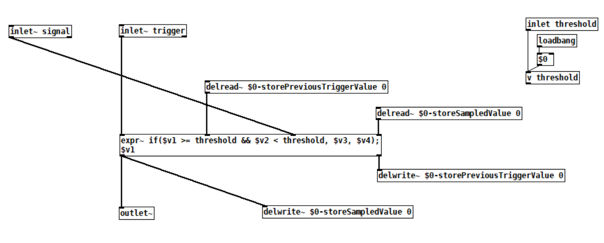

# Sample and Hold: Pure Data Implementation
While drafting the documentation for the SaH node, I thought that a Pure Data signal flow might help illustrate the process for people less familiar with DSP code. 

However, keeping everything in audio rate complicates matters, so we don't exactly end up with a typical Pd patch. In fact, if anything, this probably helps illustrate how C++ makes more sense than visual patching at this lower level of abstraction.

Pure Data already has a sample and hold object `[samphold~]`, which accepts audio rate signals through both inlets, but here's a version that adds a bonus inlet for the threshold:

- [Pure Data abstraction](./SaH_audiorate.pd)
- [Example patch](./SaH_audiorate_example.pd)

Unlike other environments like Max, there's no built-in audio-rate object for `[>~]` (a "greater than" comparison) in Pd. 
Instead, I tend to use the `[expr~]` object, which evaluates a C-like expression.[^1]

Inputs are defined within the expression as `$v1`, `$v2`, etc.
An `if` statement is formatted as follows: if(condition, outputIfTrue, outputIfFalse).
Multiple outputs can be defined by adding another expression after a semicolon (in this case, simply duplicating the input trigger value).

We can use a variable (represented by `[value]` or `[v]`) for `InputThreshold`. 
`InputTrigger` is represented by `$v1`, and `InputSignal` is `$v2`.
Other key variables would be `SampledValue` and `previousTriggerValue`. 
`[expr~]` does not allow setting variables directly within the expression, and we can't create a feedback loop even if the values don't go through the same path.  
Instead, we need to send the information out through the patch, which we do through delay lines with time set to 0 (`[delwrite~]` and `[delread~]`).
The expr~ object is used to detect when the trigger signal crosses the threshold, and then the value of the input signal is sampled and held until the next trigger event.

---

## References
- [Creating MetaSound Nodes in C++ Quickstart](https://dev.epicgames.com/community/learning/tutorials/ry7p/unreal-engine-creating-metasound-nodes-in-c-quickstart)
- [Sample and Hold on SweetWater inSync](https://www.sweetwater.com/insync/a-simple-guide-to-modulation-sample-and-hold/)

---

[^1]: We can actually use `[fexpr~]` instead: `fexpr~ if($x2[-1] < threshold && $x2[0] >= threshold, $x1[0], $y[0]);` (I've included this as [Pd implementation 2](./Pd_implementations/Sah_audiorate_fexpr.pd))...but this point, we're not really patching any more.  Besides, the above example highlights similar feedback-related barriers that we might encounter if we were to try to recreate this as a Metasound patch.