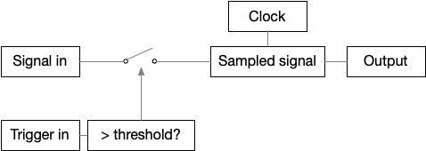

# Documentation
As a starting point for the documentation, I'm throwing together some of my notes on the custom nodes.

If you're browsing the source code and see some odd choices, please let me know!

## SaH: Audio Rate Sample and Hold

### Function
The output signal is held at the last value of the input signal when the trigger signal crosses a threshold.



The existing sample and hold function in Metasound takes an audio rate signal as input, and a trigger signal as float.

A purely audio-rate version seemed like a good starting point for my first custom node in Metasound, since it's one of my go-to building blocks in other environments such as Pd.

### Inputs

| Name       | Description                                             | Type |
|------------|---------------------------------------------------------|------|
| Signal     | Audio rate signal to be sampled.                        | Audio Buffer |
| Trigger    | Audio rate signal that triggers the sample and hold.    | Audio Buffer |
| Threshold  | Float value that determines when the trigger signal is considered "on". | Float |

### Outputs

| Name    | Description                          | Type |
|---------|--------------------------------------|------|
| Output  | The resulting sampled signal.        | Audio Buffer |

### C++ Implementation (Custom Metasound Node)

I used Anna Lantz's tutorial [Creating MetaSound Nodes in C++ Quickstart](https://dev.epicgames.com/community/learning/tutorials/ry7p/unreal-engine-creating-metasound-nodes-in-c-quickstart) as a starting point.

Most of the .cpp file is occupied by setting up the node and its pins (inlets/outlets), and registering the node. 
The implementation of the sample and hold process itself is quite straightforward, as long as you don't mind pointers (which are pretty much everywhere in this context anyway).

We could think of the constructor and execute function as "setup" and "loop" respectively.

#### Constructor
```C++
FSahOperator(
    // Parameters
    const FAudioBufferReadRef& InSignal,
    const FAudioBufferReadRef& InTrigger,
    const FFloatReadRef& InThreshold
    )

    :
    
    // Initialisation list
    , InputSignal(InSignal)
    , InputTrigger(InTrigger)
    , InputThreshold(InThreshold)
    , OutputSignal(FAudioBufferWriteRef::CreateNew(InSignal->Num()))
    , SampledValue(0.0f)
    , PreviousTriggerValue(0.0f)
    {
        // Nothing to do here...
    }
```
After the usual parameter list, we also have an initialisation list which takes care of setting the member variables. This handles everything we'd otherwise do in the constructor body in other languages.  The convention for initialisation lists is to put the commas at the start of the line, in line with the colon.

The constructor has three parameters: pointers to the buffers for input signal, the trigger signal, and the threshold. 
`SampledValue` and `PreviousTriggerValue` are just regular float variables.

#### Execute
```C++
void Execute()
    {
        int32 NumFrames = InputSignal->Num();

        const float* SignalData = InputSignal->GetData();
        const float* TriggerData = InputTrigger->GetData();
        float* OutputData = OutputSignal->GetData();

        float Threshold = *InputThreshold;

        for (int32 i = 0; i < NumFrames; ++i)
        {
            float CurrentTriggerValue = TriggerData[i];

            // Detect rising edge (compare to the previous trigger value)
            if (PreviousTriggerValue < Threshold && CurrentTriggerValue >= Threshold)
            {
                // Sample the input signal
                SampledValue = SignalData[i];
            }

            // Output the sampled value
            OutputData[i] = SampledValue;

            // Update previous trigger value
            PreviousTriggerValue = CurrentTriggerValue;
        }
    }
```

Although we're dealing with individual samples, they come in and out of the `Execute` function as blocks (audio buffers). 

Depending on the buffer size of the host, the size of this block might range from 32 to 2048 samples. This is the same buffer size we typically modify in audio software to balance latency and performance.

A block is broken down into "frames", each of which represents a sample point when information is read from each of the input buffers.[^1]

To process the signal, we therefore need to loop through these frames during each cycle of the `Execute` function: checking the trigger signal against the threshold, and writing the corresponding entry in the output buffer accordingly.

`SignalData` and `TriggerData` point to arrays of floats, as returned by `FAudioBufferReadRef`.

#### Misc Notes
Some supplementary notes on implementing the sample and hold node in Pure Data can be found [here](./Pd_implementations/SaH_Pd.md).

I'm attempting to follow [Epic's coding standards](https://dev.epicgames.com/documentation/en-us/unreal-engine/epic-cplusplus-coding-standard-for-unreal-engine?application_version=5.4) to the best of my understanding, for example:
- use PascalCase throughout
- prefixing type names e.g. `F` to indicate class definitions for structs containing floats
- header files start with `#pragma once` (only include the header once in a compilation)

---

[^1]: Not to be confused with video frames elsewhere within the engine.
